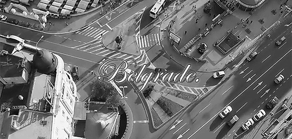

# belgrad-m152
This repository contains the documentation including our intention and personas aswell as an
in angular developed website with diffrent kinds of multi media elements.
It's made as a school project for the module 152.

## Content
1. [documentation](https://github.com/Nichtgian/belgrad-m152/tree/master/documentation) project documentation as word
1. [src](https://github.com/Nichtgian/belgrad-m152/tree/master/src) (image-)files used in the README
1. [task](https://github.com/Nichtgian/belgrad-m152/tree/master/task) the given project task and goal

## Project members
* [Gian](https://github.com/Nichtgian)
* [Manuel](https://github.com/ManuelTroxler)
* [Fabian](https://github.com/bannwafa)

## Wirefame
Further explenation of Wireframes can be found inside the documentation.

### Desktop

### Tablet

### Mobile

